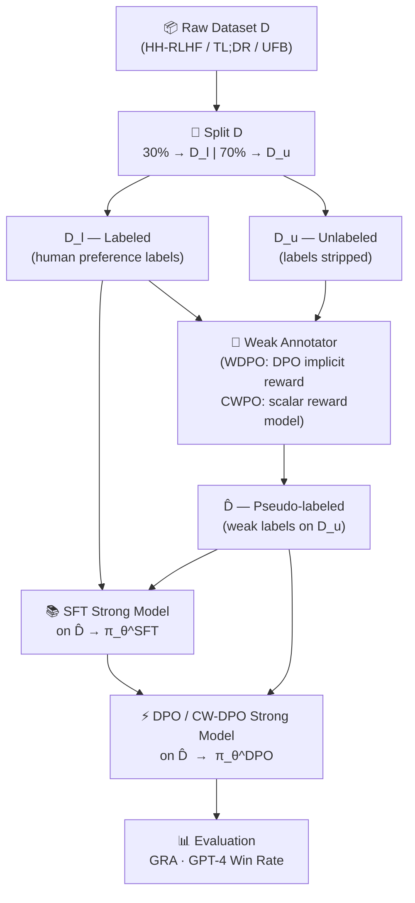
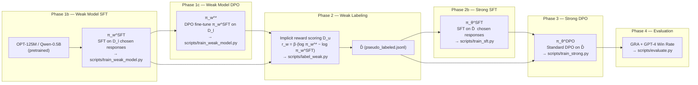
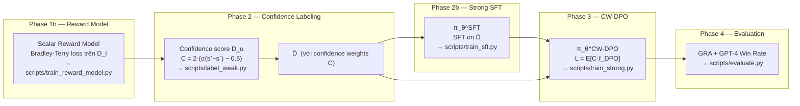
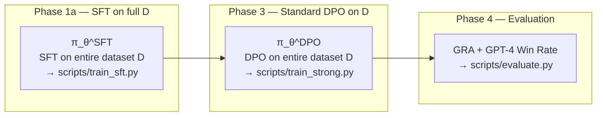
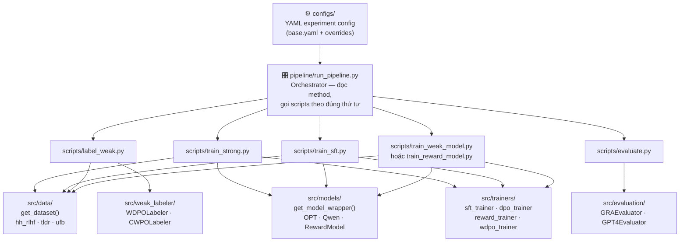

# Weak-to-Strong Preference Optimization Baselines

> Codebase baseline cho **WDPO** và **CWPO** — hai phương pháp sử dụng weak model để tạo nhãn preference và train strong model.

## Tổng quan

| Method | Weak Labeler | Strong Training | Key Feature |
|---|---|---|---|
| **Baseline DPO** | — | DPO on D_l | Only human labels |
| **WDPO** | DPO implicit reward | DPO on D̂ | Weak model labels D_u |
| **CWPO** | Scalar reward model | Confidence-weighted DPO on D̂ | C = 2·(σ(s+−s−)−0.5) |

## Workflow

Pipeline được điều phối bởi `pipeline/run_pipeline.py`. Tùy theo giá trị `method` trong config YAML, orchestrator sẽ tự động chạy đúng chuỗi các phase.

### Luồng dữ liệu tổng quát



---

### WDPO Pipeline (Option A — Traditional)



**Script entry point:** `scripts/train_weak_model.py` chạy Phase 1b+1c liên tiếp trong cùng một process, tự động giải phóng VRAM giữa hai bước.

---

### CWPO Pipeline (Option B — Recommended)



---

### Baseline DPO Pipeline



---

### Tương tác giữa các components



---

### Quy trình config → output

| Bước | Config key | Script | Output |
|---|---|---|---|
| Data split | `labeled_ratio` | — | D_l (30%), D_u (70%) |
| Weak Model SFT | `weak_model_sft.*` | `train_weak_model.py` | `weak_model_sft/` |
| Weak Model DPO | `weak_model_dpo.*` | `train_weak_model.py` | `weak_model_dpo/` |
| Reward Model | `reward_model.*` | `train_reward_model.py` | `reward_model/checkpoint-final/` |
| Weak Labeling | `weak_label_output_dir` | `label_weak.py` | `weak_labels/pseudo_labeled.jsonl` |
| Strong SFT | `sft.*` | `train_sft.py` | `sft_strong/` |
| Strong DPO | `training.*` | `train_strong.py` | `strong_model/` |
| Evaluation | `eval.*` | `evaluate.py` | `eval/results.json` |

## Cấu trúc

```
w2sg_uncertainty/
├── configs/                  # YAML experiment configs
│   ├── base.yaml             # Shared defaults
│   ├── wdpo_hh_rlhf.yaml    # WDPO + HH-RLHF
│   ├── wdpo_tldr.yaml       # WDPO + TL;DR
│   ├── cwpo_hh_rlhf.yaml   # CWPO + HH-RLHF
│   ├── cwpo_tldr.yaml       # CWPO + TL;DR
│   └── baseline_dpo_*.yaml  # Baseline configs
├── src/
│   ├── data/                 # Dataset loaders (HH-RLHF, TL;DR)
│   ├── models/               # Model wrappers (OPT, Qwen2.5, RewardModel)
│   ├── weak_labeler/         # WDPO + CWPO labelers
│   ├── losses/               # DPO + CWPO loss functions
│   ├── trainers/             # SFT, RewardModel, WDPO, CWPO trainers
│   ├── evaluation/           # GRA + GPT-4 win rate evaluators
│   └── utils/                # Config, logging, seed utils
├── scripts/
│   ├── train_sft.py          # Phase 1a: SFT strong model
│   ├── train_weak_model.py   # Phase 1b+1c: WDPO — SFT + DPO weak model
│   ├── train_reward_model.py # Phase 1b: CWPO — train scalar reward model
│   ├── label_weak.py         # Phase 2: Weak labeling (WDPO/CWPO)
│   ├── train_strong.py       # Phase 3: Strong model training (DPO / CW-DPO)
│   └── evaluate.py           # Phase 4: Evaluation
├── pipeline/
│   └── run_pipeline.py       # End-to-end pipeline orchestrator
└── tests/                    # Unit tests
```

## Quick Start

### 1. Cài đặt

```bash
pip install -e .
# hoặc
pip install -r requirements.txt
```

### 2. Chạy end-to-end pipeline

#### WDPO (Option A — Traditional)

```bash
# WDPO: OPT-125M (weak) → OPT-1.3B (strong), không LoRA
python pipeline/run_pipeline.py --config wdpo_hh_rlhf.yaml

# WDPO với LoRA rank=8 (khuyến nghị cho model lớn)
python pipeline/run_pipeline.py --config wdpo_hh_rlhf.yaml \
    use_lora=true lora_r=8 lora_alpha=16

# WDPO với Qwen2.5-7B strong model + LoRA rank=8 + multi-GPU
python pipeline/run_pipeline.py --config wdpo_hh_rlhf.yaml \
    strong_model_name=Qwen/Qwen2.5-7B \
    use_lora=true lora_r=8 lora_alpha=16 \
    sft.gradient_checkpointing=true

# WDPO trên TL;DR dataset
python pipeline/run_pipeline.py --config configs/wdpo_tldr.yaml \
    use_lora=true lora_r=8 lora_alpha=16
```

#### CWPO (Option B — Recommended)

```bash
# CWPO: OPT-125M scalar reward (weak) → OPT-1.3B CW-DPO (strong)
python pipeline/run_pipeline.py --config configs/cwpo_hh_rlhf.yaml

# CWPO với LoRA rank=8 (khuyến nghị)
python pipeline/run_pipeline.py --config configs/cwpo_hh_rlhf.yaml \
    use_lora=true lora_r=8 lora_alpha=16

# CWPO với Qwen2.5-7B strong model + LoRA rank=8 + multi-GPU
python pipeline/run_pipeline.py --config configs/cwpo_hh_rlhf.yaml \
    strong_model_name=Qwen/Qwen2.5-7B \
    use_lora=true lora_r=8 lora_alpha=16 \
    sft.gradient_checkpointing=true \
    training.gradient_checkpointing=true

# CWPO trên TL;DR dataset
python pipeline/run_pipeline.py --config configs/cwpo_tldr.yaml \
    use_lora=true lora_r=8 lora_alpha=16
```

#### Baseline DPO

```bash
# Baseline DPO (chỉ dùng D_l, không weak labeling)
python pipeline/run_pipeline.py --config configs/baseline_dpo_hh_rlhf.yaml

# Debug mode (fast, dữ liệu nhỏ, không wandb)
python pipeline/run_pipeline.py --config configs/cwpo_hh_rlhf.yaml --debug
```

### 3. Chạy từng bước

#### WDPO step-by-step

```bash
# Phase 1a: SFT strong model
python scripts/train_sft.py --config configs/wdpo_hh_rlhf.yaml \
    use_lora=true lora_r=8 lora_alpha=16

# Phase 1b+1c (WDPO only): Train weak model SFT → DPO → π_w^*
python scripts/train_weak_model.py --config configs/wdpo_hh_rlhf.yaml

# Phase 2: Weak labeling bằng implicit reward r_w(x,y) = β·(log π_w^* − log π_w^SFT)
python scripts/label_weak.py --config configs/wdpo_hh_rlhf.yaml

# Phase 3: Train strong model với standard DPO trên D̂
python scripts/train_strong.py --config configs/wdpo_hh_rlhf.yaml \
    --pseudo_labels outputs/wdpo/hh_rlhf/weak_labels/pseudo_labeled.jsonl \
    --sft_model_path outputs/wdpo/hh_rlhf/sft_strong \
    use_lora=true lora_r=8 lora_alpha=16

# Phase 4: Evaluate (GRA)
python scripts/evaluate.py \
    --config configs/wdpo_hh_rlhf.yaml \
    --aligned_model_path outputs/wdpo/hh_rlhf/strong_model \
    --sft_model_path outputs/wdpo/hh_rlhf/sft_strong
```

#### CWPO step-by-step

```bash
# Phase 1a: SFT strong model
python scripts/train_sft.py --config configs/cwpo_hh_rlhf.yaml \
    use_lora=true lora_r=8 lora_alpha=16

# Phase 1b (CWPO only): Train scalar reward model bằng Bradley-Terry loss
python scripts/train_reward_model.py --config configs/cwpo_hh_rlhf.yaml

# Phase 2: Weak labeling bằng scalar score → confidence C = 2·(σ(s+−s−)−0.5)
python scripts/label_weak.py --config configs/cwpo_hh_rlhf.yaml \
    --reward_model_path outputs/cwpo/hh_rlhf/reward_model/checkpoint-final/model.pt

# Phase 3: Train strong model với CW-DPO trên D̂ (có confidence weight)
python scripts/train_strong.py --config configs/cwpo_hh_rlhf.yaml \
    --pseudo_labels outputs/cwpo/hh_rlhf/weak_labels/pseudo_labeled.jsonl \
    --sft_model_path outputs/cwpo/hh_rlhf/sft_strong \
    use_lora=true lora_r=8 lora_alpha=16

# Phase 4: Evaluate
python scripts/evaluate.py \
    --config configs/cwpo_hh_rlhf.yaml \
    --aligned_model_path outputs/cwpo/hh_rlhf/strong_model \
    --sft_model_path outputs/cwpo/hh_rlhf/sft_strong
```

### 4. Thay đổi model size

Chỉ cần override trong YAML hoặc CLI:

```bash
# Strong model OPT-2.7B thay vì OPT-1.3B
python pipeline/run_pipeline.py --config configs/wdpo_hh_rlhf.yaml \
    strong_model_name=facebook/opt-2.7b \
    training.output_dir=outputs/wdpo/hh_rlhf/opt2.7b

# Qwen2.5-1.5B
python pipeline/run_pipeline.py --config configs/cwpo_hh_rlhf.yaml \
    strong_model_name=Qwen/Qwen2.5-1.5B

# Weak model Qwen2.5-0.5B
python pipeline/run_pipeline.py --config configs/cwpo_hh_rlhf.yaml \
    weak_model_name=Qwen/Qwen2.5-0.5B
```

### 5. Bật LoRA (rank=8, khuyến nghị)

```bash
# WDPO + LoRA r=8
python pipeline/run_pipeline.py --config configs/wdpo_hh_rlhf.yaml \
    use_lora=true lora_r=8 lora_alpha=16

# CWPO + LoRA r=8
python pipeline/run_pipeline.py --config configs/cwpo_hh_rlhf.yaml \
    use_lora=true lora_r=8 lora_alpha=16
```

**LoRA config mặc định trong `base.yaml`:**

```yaml
use_lora: false
lora_r: 8          # rank — đề xuất dùng 8
lora_alpha: 16     # = 2 × lora_r (quy ước thông thường)
lora_dropout: 0.05
lora_target_modules: null  # null = PEFT tự detect (q_proj, v_proj, ...)
```

### 6. Thay đổi Batch Size

Batch size hiệu quả = `per_device_train_batch_size × gradient_accumulation_steps`.
Thay đổi qua CLI override để không cần sửa file YAML:

#### Thay đổi cho SFT (`sft.*`)

```bash
# Tăng batch size SFT lên 32 effective (batch=8, grad_accum=4)
python pipeline/run_pipeline.py --config configs/wdpo_hh_rlhf.yaml \
    sft.per_device_train_batch_size=8 \
    sft.gradient_accumulation_steps=4

# Giảm batch size SFT xuống 4 effective (cho GPU VRAM nhỏ)
python pipeline/run_pipeline.py --config configs/wdpo_hh_rlhf.yaml \
    sft.per_device_train_batch_size=1 \
    sft.gradient_accumulation_steps=4
```

#### Thay đổi cho DPO/WDPO/CWPO training (`training.*`)

```bash
# Batch size DPO = 32 effective (batch=8, grad_accum=4)
python pipeline/run_pipeline.py --config configs/wdpo_hh_rlhf.yaml \
    training.per_device_train_batch_size=8 \
    training.gradient_accumulation_steps=4

# Batch size DPO = 4 effective (batch=1, grad_accum=4) — cho GPU yếu
python pipeline/run_pipeline.py --config configs/cwpo_hh_rlhf.yaml \
    training.per_device_train_batch_size=1 \
    training.gradient_accumulation_steps=4

# Thay đổi đồng thời cả SFT và DPO
python pipeline/run_pipeline.py --config configs/cwpo_hh_rlhf.yaml \
    use_lora=true lora_r=8 lora_alpha=16 \
    sft.per_device_train_batch_size=2 \
    sft.gradient_accumulation_steps=8 \
    training.per_device_train_batch_size=2 \
    training.gradient_accumulation_steps=8
```

#### Thay đổi cho Weak Model DPO (`weak_model_dpo.*`) — WDPO only

```bash
python pipeline/run_pipeline.py --config configs/wdpo_hh_rlhf.yaml \
    weak_model_dpo.per_device_train_batch_size=2 \
    weak_model_dpo.gradient_accumulation_steps=4
```

#### Thay đổi trong file YAML (khuyến nghị cho thực nghiệm lâu dài)

Sửa trực tiếp trong `configs/wdpo_hh_rlhf.yaml` hoặc `configs/cwpo_hh_rlhf.yaml`:

```yaml
# configs/wdpo_hh_rlhf.yaml
sft:
  per_device_train_batch_size: 2   # thay đổi ở đây
  gradient_accumulation_steps: 8   # → effective batch = 2×8 = 16

training:
  per_device_train_batch_size: 2
  gradient_accumulation_steps: 8
```

#### Bảng hướng dẫn batch size theo VRAM

| VRAM per GPU | `per_device_train_batch_size` | `gradient_accumulation_steps` | Effective batch |
|---|---|---|---|
| ≥ 24 GB | 8 | 2 | 16 |
| 16 GB | 4 | 4 | 16 |
| 10 GB (RTX 3080) | 2 | 8 | 16 |
| 8 GB | 1 | 16 | 16 |
| < 8 GB | 1 | 4–8 | 4–8 |

### 6. Resume từ Checkpoint

Tất cả training scripts đều hỗ trợ tiếp tục train từ checkpoint có sẵn, hữu ích khi job bị cancel giữa chừng hoặc muốn train thêm epoch.

#### Tóm tắt các flags

| Script | Flag | Ý nghĩa |
|---|---|---|
| `train_sft.py` | `--resume_sft_checkpoint` | Resume SFT strong model |
| `train_strong.py` | `--resume_dpo_checkpoint` | Resume DPO strong model (baseline / WDPO / CWPO) |
| `train_weak_model.py` | `--resume_weak_sft_checkpoint` | Resume weak model SFT (bước 1) |
| `train_weak_model.py` | `--resume_weak_dpo_checkpoint` | Resume weak model DPO (bước 2) |
| `train_reward_model.py` | `--resume_reward_checkpoint` | Resume reward model (CWPO) |

> **Lưu ý về `--resume_dpo_checkpoint`:** Base model + tokenizer vẫn được load từ `--sft_model_path` (vì LoRA checkpoint chỉ chứa `adapter_model.safetensors`, không có tokenizer files). HF Trainer tự động re-load adapter weights từ checkpoint, restore optimizer/scheduler state, và bỏ qua các steps đã chạy.

---

#### Resume SFT (train_sft.py)

```bash
# SFT bị cancel tại checkpoint-500, resume train tiếp
python scripts/train_sft.py --config configs/baseline_dpo_hh_rlhf.yaml \
    --resume_sft_checkpoint outputs/baseline_dpo/hh_rlhf/sft_strong/checkpoint-500

# Resume SFT với multi-GPU
CUDA_VISIBLE_DEVICES=1,2,3 python scripts/train_sft.py \
    --config configs/wdpo_hh_rlhf.yaml \
    --resume_sft_checkpoint outputs/wdpo/hh_rlhf/sft_strong/checkpoint-500 \
    use_lora=true lora_r=8 lora_alpha=16
```

#### Resume DPO Strong Model (train_strong.py)

```bash
# Baseline DPO — resume từ checkpoint-20200
python scripts/train_strong.py --config configs/baseline_dpo_hh_rlhf.yaml \
    --resume_dpo_checkpoint outputs/baseline_dpo/hh_rlhf/strong_model/checkpoint-20200 \
    use_lora=true lora_r=8 lora_alpha=16

# WDPO — resume DPO strong model
python scripts/train_strong.py --config configs/wdpo_hh_rlhf.yaml \
    --pseudo_labels outputs/wdpo/hh_rlhf/weak_labels/pseudo_labeled.jsonl \
    --resume_dpo_checkpoint outputs/wdpo/hh_rlhf/strong_model/checkpoint-5000 \
    use_lora=true lora_r=8 lora_alpha=16

# CWPO — resume CW-DPO strong model
python scripts/train_strong.py --config configs/cwpo_hh_rlhf.yaml \
    --pseudo_labels outputs/cwpo/hh_rlhf/weak_labels/pseudo_labeled.jsonl \
    --resume_dpo_checkpoint outputs/cwpo/hh_rlhf/strong_model/checkpoint-5000 \
    use_lora=true lora_r=8 lora_alpha=16
```

#### Resume Weak Model (train_weak_model.py — WDPO only)

```bash
# Resume weak model SFT (bước 1)
python scripts/train_weak_model.py --config configs/wdpo_hh_rlhf.yaml \
    --resume_weak_sft_checkpoint outputs/wdpo/hh_rlhf/weak_model_sft/checkpoint-300

# Resume weak model DPO (bước 2) — bỏ qua SFT bằng --skip_sft
python scripts/train_weak_model.py --config configs/wdpo_hh_rlhf.yaml \
    --skip_sft \
    --weak_sft_path outputs/wdpo/hh_rlhf/weak_model_sft \
    --resume_weak_dpo_checkpoint outputs/wdpo/hh_rlhf/weak_model_dpo/checkpoint-500

# Resume cả hai bước (train SFT từ đầu, nhưng DPO resume từ checkpoint)
python scripts/train_weak_model.py --config configs/wdpo_hh_rlhf.yaml \
    --resume_weak_dpo_checkpoint outputs/wdpo/hh_rlhf/weak_model_dpo/checkpoint-500
```

#### Resume Reward Model (train_reward_model.py — CWPO only)

```bash
# Resume reward model từ checkpoint-500
python scripts/train_reward_model.py --config configs/cwpo_hh_rlhf.yaml \
    --resume_reward_checkpoint outputs/cwpo/hh_rlhf/reward_model/checkpoint-500
```

#### Resume qua Pipeline (run_pipeline.py)

Pipeline hỗ trợ forward 2 flags xuống scripts con:

```bash
# Baseline DPO: SFT đã xong, resume DPO từ checkpoint-20200
CUDA_VISIBLE_DEVICES=1,2,3 python pipeline/run_pipeline.py \
    --config configs/baseline_dpo_hh_rlhf.yaml \
    --skip_sft \
    --sft_model_path outputs/baseline_dpo/hh_rlhf/sft_strong \
    --resume_dpo_checkpoint outputs/baseline_dpo/hh_rlhf/strong_model/checkpoint-20200 \
    use_lora=true lora_r=8 lora_alpha=16

# WDPO: resume SFT Phase 2b từ checkpoint-500
CUDA_VISIBLE_DEVICES=1,2,3 python pipeline/run_pipeline.py \
    --config configs/wdpo_hh_rlhf.yaml \
    --skip_weak_model \
    --pseudo_labels outputs/wdpo/hh_rlhf/weak_labels/pseudo_labeled.jsonl \
    --resume_sft_checkpoint outputs/wdpo/hh_rlhf/sft_strong/checkpoint-500 \
    use_lora=true lora_r=8 lora_alpha=16

# CWPO: resume DPO Phase 3 từ checkpoint-5000
CUDA_VISIBLE_DEVICES=1,2,3 python pipeline/run_pipeline.py \
    --config configs/cwpo_hh_rlhf.yaml \
    --skip_reward_model --skip_sft \
    --pseudo_labels outputs/cwpo/hh_rlhf/weak_labels/pseudo_labeled.jsonl \
    --sft_model_path outputs/cwpo/hh_rlhf/sft_strong \
    --resume_dpo_checkpoint outputs/cwpo/hh_rlhf/strong_model/checkpoint-5000 \
    use_lora=true lora_r=8 lora_alpha=16
```

> **Pipeline lưu ý:** Pipeline chỉ forward `--resume_sft_checkpoint` và `--resume_dpo_checkpoint`. Để resume reward model hoặc weak model, chạy script tương ứng trực tiếp.

---

### 7. Multi-GPU Training (4× RTX 3080 / card 10 GB)

#### Root cause của lỗi OOM

Mặc định, HuggingFace Trainer nạp toàn bộ model lên **GPU 0**.
Với Qwen2.5-7B (~14 GB @ bfloat16), điều này gây OOM ngay khi khởi tạo.

```
torch.OutOfMemoryError: CUDA out of memory.
GPU 0 has a total capacity of 9.65 GiB of which 26.75 MiB is free.
```

#### Giải pháp: `device_map`

Thêm `device_map: auto` vào config — HuggingFace tự shard model qua tất cả GPU có sẵn:

```
Qwen2.5-7B (14 GB params @ bfloat16)
    ↓ device_map="auto"
GPU 0 (10 GB): layers 0–8
GPU 1 (10 GB): layers 9–17
GPU 2 (10 GB): layers 18–26
GPU 3 (10 GB): layers 27–35 + lm_head
```

> **Không cần `torchrun`** — đây là model parallelism (khác với DDP).
> `run_pipeline.py` giữ nguyên, chỉ cần đổi flag trong YAML hoặc CLI.

#### Hướng dẫn sử dụng

**Single GPU (model nhỏ, ≤3B)** — giữ `device_map: null` mặc định:

```bash
# OPT-125m / 350m / 1.3b / 2.7b, Qwen2.5-0.5B / 1.5B / 3B
# Không cần đổi gì
python pipeline/run_pipeline.py --config configs/wdpo_hh_rlhf.yaml
```

**Multi-GPU (model lớn, 7B+)** — thêm `device_map=auto`:

```bash
# WDPO với Qwen2.5-7B strong model + LoRA rank=8
python pipeline/run_pipeline.py --config configs/wdpo_hh_rlhf.yaml \
    strong_model_name=Qwen/Qwen2.5-7B \
    use_lora=true lora_r=8 lora_alpha=16 \
    sft.gradient_checkpointing=true

# CWPO với Qwen2.5-7B strong model + LoRA rank=8
python pipeline/run_pipeline.py --config configs/cwpo_hh_rlhf.yaml \
    strong_model_name=Qwen/Qwen2.5-7B \
    use_lora=true lora_r=8 lora_alpha=16 \
    sft.gradient_checkpointing=true \
    training.gradient_checkpointing=true

# Hoặc dùng device_map=auto (không LoRA)
python pipeline/run_pipeline.py --config configs/wdpo_hh_rlhf.yaml \
    strong_model_name=Qwen/Qwen2.5-7B \
    device_map=auto \
    sft.gradient_checkpointing=true \
    training.gradient_checkpointing=true

# OPT-6.7B / 13B
python pipeline/run_pipeline.py --config configs/wdpo_hh_rlhf.yaml \
    strong_model_name=facebook/opt-6.7b \
    device_map=auto
```

**Hoặc sửa thẳng trong YAML** (khuyến nghị cho thực nghiệm lâu dài):

```yaml
# configs/wdpo_hh_rlhf.yaml
strong_model_name: Qwen/Qwen2.5-7B
device_map: auto          # null = single GPU | auto = multi-GPU model parallel

sft:
  gradient_checkpointing: true   # giảm VRAM ~30-40%

training:
  gradient_checkpointing: true
```

#### Bảng chọn `device_map` theo model và VRAM

| Model | VRAM (bfloat16) | `device_map` | `gradient_checkpointing` |
|---|---|---|---|
| OPT-125m – 2.7b | < 6 GB | `null` | false |
| OPT-6.7b | ~13 GB | `auto` | true |
| OPT-13b | ~26 GB | `auto` | true |
| Qwen2.5-0.5B – 3B | < 7 GB | `null` | false |
| Qwen2.5-7B | ~14 GB | `auto` | true |
| Qwen2.5-14B | ~28 GB | `auto` | true |

#### Các giá trị `device_map` hợp lệ

| Giá trị | Mô tả |
|---|---|
| `null` | Single GPU — Trainer tự đưa model vào `cuda:0` |
| `"auto"` | HuggingFace shard qua tất cả GPU theo free VRAM |
| `"balanced"` | Chia đều layers qua tất cả GPU |

> **Lưu ý**: Khi `use_lora=true`, `device_map` tự động bật `"auto"` (PEFT yêu cầu để gradient offloading multi-GPU).

## Chạy Unit Tests

```bash
pytest tests/ -v
```

## Evaluation Metrics

| Metric | Mô tả |
|---|---|
| **GRA** (Gold Reward Accuracy) | P(r(aligned) > r(SFT)) theo pretrained reward model |
| **GPT-4 Win Rate** | GPT-4 đánh điểm 1-10, tính win rate aligned vs SFT |
| **Preference Accuracy** | Weak label accuracy so với human labels (sanity check) |

## Extending

### Thêm dataset mới

```python
# src/data/my_dataset.py
from src.data.base_dataset import BasePreferenceDataset, PreferenceSample

class MyDataset(BasePreferenceDataset):
    def load_raw(self, split, cache_dir):
        return load_dataset("my/dataset", split=split)

    def preprocess_sample(self, raw):
        return PreferenceSample(
            prompt=raw["input"],
            chosen=raw["output_a"],
            rejected=raw["output_b"],
        )
```

Sau đó đăng ký trong `src/data/__init__.py`:
```python
DATASET_REGISTRY["my_dataset"] = MyDataset
```

### Thêm model family mới

```python
# src/models/llama_model.py
from src.models.base_model import BaseModelWrapper

class LlamaModelWrapper(BaseModelWrapper):
    def load_model_and_tokenizer(self):
        ...
```

### Thêm phương pháp labeling mới

```python
# src/weak_labeler/my_labeler.py
from src.weak_labeler.base_labeler import BaseWeakLabeler, PseudoLabeledSample

class MyLabeler(BaseWeakLabeler):
    def label_dataset(self, dataset, max_samples=None):
        ...
```

## Configuration

Tất cả config có thể override từ CLI:

```bash
# Thay đổi hyperparameter cơ bản
python pipeline/run_pipeline.py --config configs/wdpo_hh_rlhf.yaml \
    labeled_ratio=0.2 \
    training.beta=0.05 \
    training.learning_rate=1e-6 \
    seed=123

# Thay đổi batch size
python pipeline/run_pipeline.py --config configs/wdpo_hh_rlhf.yaml \
    sft.per_device_train_batch_size=2 \
    sft.gradient_accumulation_steps=8 \
    training.per_device_train_batch_size=2 \
    training.gradient_accumulation_steps=8

# Thay đổi LoRA rank
python pipeline/run_pipeline.py --config configs/cwpo_hh_rlhf.yaml \
    use_lora=true lora_r=8 lora_alpha=16 lora_dropout=0.05

# Đổi dataset và model cùng lúc
python pipeline/run_pipeline.py --config configs/cwpo_hh_rlhf.yaml \
    dataset_name=tldr \
    strong_model_name=Qwen/Qwen2.5-3B \
    weak_model_name=Qwen/Qwen2.5-0.5B \
    use_lora=true lora_r=8 lora_alpha=16
```

## Models Supported

| Weak Models | Strong Models | `device_map` cần thiết |
|---|---|---|
| `facebook/opt-125m` | `facebook/opt-1.3b` | `null` |
| `Qwen/Qwen2.5-0.5B` | `facebook/opt-2.7b` | `null` |
| | `facebook/opt-6.7b` | `auto` |
| | `facebook/opt-13b` | `auto` |
| | `Qwen/Qwen2.5-1.5B` | `null` |
| | `Qwen/Qwen2.5-3B` | `null` |
| | `Qwen/Qwen2.5-7B` | `auto` |
| | `Qwen/Qwen2.5-14B` | `auto` |

## Papers

- **WDPO**: Weak Supervision DPO — weak model labels D_u via implicit reward
- **CWPO**: Confidence-Weighted PO — `L = E[C(x,y+,y−)·ℓDPO]` where `C = 2·(σ(s+−s−)−0.5)`


# Đủ nhanh (~40 phút với 500 samples default):
CUDA_VISIBLE_DEVICES=1,2,3 python scripts/evaluate.py \
    --config configs/wdpo_hh_rlhf.yaml \
    --aligned_model_path outputs/wdpo/hh_rlhf/strong_model \
    --sft_model_path outputs/wdpo/hh_rlhf/sft_strong
# Nếu muốn override số samples tùy thích:
CUDA_VISIBLE_DEVICES=1,2,3 python scripts/evaluate.py \
    --config configs/wdpo_hh_rlhf.yaml \
    --aligned_model_path outputs/wdpo/hh_rlhf/strong_model \
    --sft_model_path outputs/wdpo/hh_rlhf/sft_strong \
    eval.max_gen_samples=200
