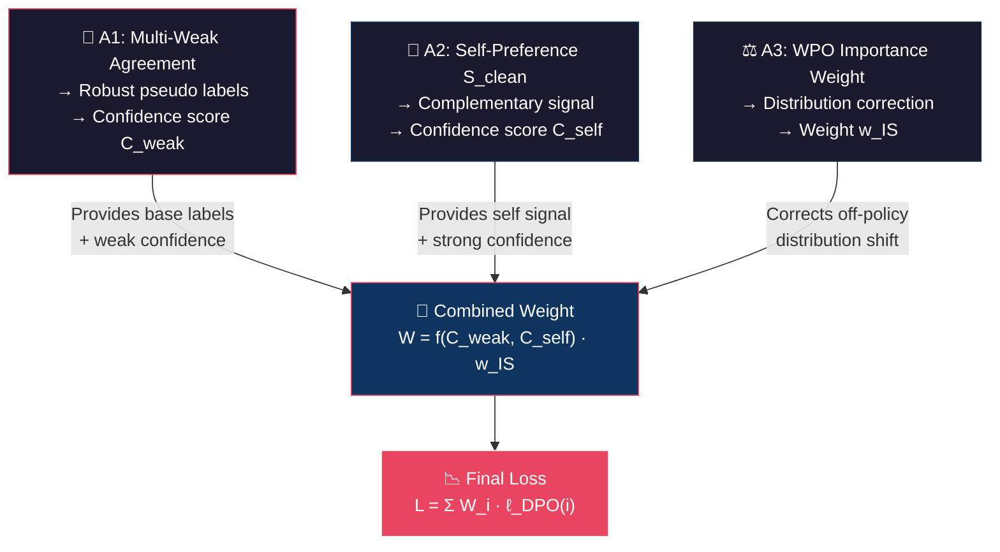

# Debate: Multi-Agreement W2SG + Self-Preference + WPO cho DPO Alignment

## 1. Tóm tắt ý tưởng

Bạn đề xuất một phương pháp DPO training cho strong model dựa trên **3 trụ cột (anchors)**:

| # | Anchor | Ý nghĩa |
|---|--------|---------|
| **A1** | **Multi-Agreement giữa nhiều weak models** | 3 weak models (đã aligned) cùng vote/score preference trên D_weak → tăng độ tin cậy nhãn pseudo |
| **A2** | **Self-preference của S_clean** | Strong model S_clean (đã aligned trên D_clean) tự đánh giá preference → khai thác implicit knowledge của strong model |
| **A3** | **WPO (Weighted Preference Optimization)** | Dùng importance weight `π_θ(y|x) / π_ref(y|x)` để re-weight loss → giảm distribution gap của off-policy DPO |

**Mục tiêu cuối cùng**: Train strong model mới (khởi tạo từ S_clean) theo DPO mà **không bị distribution gap** — vấn đề cốt lõi của off-policy DPO khi data sinh ra bởi policy khác (weak models) chứ không phải chính strong model.

---

## 2. Debate: Phân tích từng Anchor

### 2.1. Anchor A1 — Multi-Agreement giữa nhiều weak models

#### Cơ chế
3 weak models $w_1, w_2, w_3$ (đã aligned trên dataset khác) cùng đánh preference cho mỗi cặp $(x, y_1, y_2)$ trong $D_\text{weak}$.

Có 2 cách tính agreement:

**Cách 1: Majority Vote (Hard Agreement)**
$$a_\text{hard}(x, y_1, y_2) = \frac{1}{K}\sum_{k=1}^{K} \mathbb{1}[\text{weak}_k \text{ chọn } y_1 \succ y_2]$$

Lấy nhãn theo majority (≥2/3 đồng ý), confidence = tỷ lệ đồng thuận.

**Cách 2: Soft Score Agreement (khuyến nghị)**
$$a_\text{soft}(x, y_1, y_2) = 1 - \text{Var}\left(\{s_k(x, y_1) - s_k(x, y_2)\}_{k=1}^{K}\right) / Z$$

Trong đó $s_k$ là implicit reward hoặc scalar score từ weak model $k$, $Z$ là normalizing constant.

#### ✅ Strengths
- **Giảm noise nhãn đáng kể**: Một weak model có thể sai, nhưng 3 models cùng sai theo cùng hướng ít xảy ra hơn → "wisdom of crowds"
- **Uncertainty estimation tự nhiên**: Mức độ agreement = proxy tốt cho uncertainty. Samples mà 3 weak models bất đồng → likely ambiguous/hard → nên down-weight
- **Không cần thêm human annotation**: Tận dụng tối đa weak supervision
- **Có literature support**: Ensemble methods trong ML đã được chứng minh hiệu quả (Bagging, Boosting, Mixture of Experts)

#### ❌ Weaknesses
- **Correlated errors**: Nếu 3 weak models cùng family (ví dụ 3 OPT-125M với seed khác), chúng có thể share systematic bias → agreement cao nhưng vẫn sai. **Giải pháp**: Dùng weak models từ families khác nhau (OPT-125M + Qwen-0.5B + Phi-2)
- **Chi phí inference ×3**: Phải chạy inference 3 models trên toàn bộ D_weak. Tuy nhiên weak models nhỏ (125M-0.5B) nên chi phí vẫn manageable
- **Alignment bias**: Nếu 3 weak models aligned trên cùng dataset → systematic alignment bias tương tự nhau
- **Ceiling effect**: Weak models vốn yếu → agreement giữa chúng chỉ reliable cho "easy" samples. Với hard samples (mà strong model cần học), agreement có thể misleading

> [!WARNING]
> **Critical Weakness**: Multi-agreement chỉ đo "weak models có đồng ý không" — KHÔNG đo "câu trả lời có đúng không". High agreement ≠ High quality. Cần kết hợp với A2 (self-preference) để bổ sung.

---

### 2.2. Anchor A2 — Self-preference của S_clean

#### Cơ chế
S_clean (strong model đã aligned trên D_clean nhỏ) tự đánh giá preference bằng implicit reward:

$$r_\text{self}(x, y) = \beta \cdot \left(\log \pi_{S_\text{clean}}(y|x) - \log \pi_\text{ref}(y|x)\right)$$

Hoặc dùng S_clean như "judge" — cho S_clean score cả $y_1$ và $y_2$, chọn response có score cao hơn.

#### ✅ Strengths
- **Khai thác knowledge gap**: S_clean đã biết nhiều hơn weak models → self-preference quality cao hơn weak preference cho nhiều trường hợp
- **Distribution alignment**: Self-preference đến từ chính strong model → data "gần" với strong model distribution hơn → **trực tiếp giải quyết distribution gap**
- **Complements A1**: Weak agreement tốt cho easy samples, self-preference tốt cho hard samples mà weak models bất đồng
- **Có support từ literature**: Self-play, Constitutional AI (Anthropic), self-improvement paradigm

#### ❌ Weaknesses
- **Confirmation bias / Echo chamber**: S_clean tự đánh → reinforce own biases. Nếu S_clean sai ở đâu, nó sẽ tiếp tục sai
- **D_clean nhỏ → S_clean chưa reliable**: Nếu S_clean chỉ aligned trên tập nhỏ, implicit reward có thể noisy và overfit vào D_clean
- **Reward hacking tự thân**: Model có thể assign high reward cho responses dài, verbose nhưng thực tế không tốt hơn
- **Circular dependency risk**: Train strong mới dựa trên self-assessment của strong cũ → nếu không cẩn thận sẽ amplify errors

> [!IMPORTANT]
> **Key Insight**: Self-preference đặc biệt hữu ích khi kết hợp **chọn lọc** — chỉ tin self-preference khi nó confident VÀ khi weak models bất đồng (high uncertainty). Khi weak models đồng thuận cao, nên ưu tiên weak labels (avoid confirmation bias).

---

### 2.3. Anchor A3 — WPO (Weighted Preference Optimization)

#### Cơ chế (paper: Zhou et al., 2024)
WPO re-weight DPO loss bằng importance sampling ratio:

$$\mathcal{L}_\text{WPO} = -\mathbb{E}\left[\frac{\pi_\theta(y_w|x) \cdot \pi_\theta(y_l|x)}{\pi_\text{ref}(y_w|x) \cdot \pi_\text{ref}(y_l|x)} \cdot \log\sigma\left(\beta \cdot \Delta\right)\right]$$

Trong đó $\Delta = \log\frac{\pi_\theta(y_w|x)}{\pi_\text{ref}(y_w|x)} - \log\frac{\pi_\theta(y_l|x)}{\pi_\text{ref}(y_l|x)}$

Ý tưởng: Data $(x, y_w, y_l)$ được sinh bởi $\pi_\text{ref}$, nhưng ta đang train $\pi_\theta$. Importance weight $\frac{\pi_\theta}{\pi_\text{ref}}$ điều chỉnh sao cho loss "nhìn thấy" data theo distribution của $\pi_\theta$ thay vì $\pi_\text{ref}$.

#### ✅ Strengths
- **Directly addresses distribution gap**: Đây là giải pháp toán học trực tiếp cho vấn đề off-policy trong DPO
- **Đã có empirical evidence**: WPO paper cho thấy improvements trên nhiều benchmarks (AlpacaEval 2, MT-Bench)
- **Gradient tự nhiên**: High importance weight → sample này "quan trọng" dưới policy hiện tại → gradient lớn hơn. Low weight → sample xa distribution hiện tại → gradient nhỏ
- **Compatible với confidence weighting**: Có thể nhân thêm confidence weight từ A1/A2 mà không conflict

#### ❌ Weaknesses
- **Variance cao**: Importance sampling nổi tiếng high variance. Khi $\pi_\theta$ diverge xa $\pi_\text{ref}$, ratio có thể explode → training instability
- **Cần clipping/normalization**: Phải clip importance weights (ví dụ max 5-10) để tránh gradient explosion
- **Thêm computational cost**: Mỗi step phải compute ratio cho cả chosen và rejected → thêm forward pass
- **Interplay phức tạp với β**: β trong DPO đã control KL penalty. Thêm importance weight tạo ra interaction effect khó tune

> [!NOTE]
> WPO trong bài toán W2SG có ý nghĩa đặc biệt: data preference đến từ weak models (A1) và self-preference (A2) — cả hai đều **không phải** distribution của strong model đang train. Importance weighting giúp "kéo" gradient focus vào vùng mà strong model hiện tại care.

---

## 3. Đánh giá tổng thể: Kết hợp 3 Anchors

### 3.1. Synergy Map



### 3.2. Overall Strengths

| Aspect | Benefit |
|--------|---------|
| **Robustness** | Triple-source supervision (3 weak + self + importance) → giảm risk của single-source failure |
| **Distribution gap** | WPO trực tiếp xử lý. Self-preference gián tiếp xử lý (data gần strong dist) |
| **Scalability** | Weak models nhỏ → inference rẻ. Self-preference = 1 forward pass of strong model |
| **Principled** | Mỗi component có theoretical justification riêng |
| **Complementary** | A1 mạnh ở easy samples, A2 mạnh ở hard samples, A3 điều chỉnh distribution cho cả hai |

### 3.3. Overall Weaknesses

| Aspect | Risk | Mitigation |
|--------|------|------------|
| **Complexity** | 3 signals + weighting → quá nhiều hyperparameters | Dùng adaptive weighting (xem Section 5) |
| **Training stability** | IS weights × confidence weights → gradient variance rất cao | Clip IS weights, normalize confidence |
| **Computational cost** | 3 weak models + self-preference + IS computation | Batch inference, cache log-probs |
| **Diminishing returns** | Benefit thêm từ A2 và A3 có thể marginal nếu A1 đã đủ tốt | Ablation study cần thiết |
| **Hyperparameter sensitivity** | α, λ (balancing weights) giữa 3 anchors khó tune | Grid search hoặc learned weighting |

> [!CAUTION]
> **Biggest Risk**: Quá nhiều "corrections" chồng chéo có thể khiến training signal quá yếu (mọi thứ đều bị down-weight) hoặc quá noisy. Cần ablation: A1 only → A1+A2 → A1+A2+A3 để verify mỗi component thực sự add value.

---

## 4. Recommendations theo Model Scale

### 4.1. Bảng khuyến nghị

| Strong Model Size | Weak Model(s) | Khuyến nghị | Lý do |
|-------------------|---------------|-------------|-------|
| **≤ 1.5B** (OPT-1.3B, Qwen-1.5B) | OPT-125M, Qwen-0.5B | **Chỉ dùng A1 + A3** (bỏ A2) | Strong model nhỏ → self-preference không reliable. Gap giữa weak và strong nhỏ → agreement là đủ |
| **3B–7B** (Qwen-3B, Qwen-7B) | OPT-125M, Qwen-0.5B, Phi-2 | **Dùng cả A1 + A2 + A3** | Đây là sweet spot: strong model đủ lớn để self-preference meaningful, gap đủ lớn để cần WPO |
| **≥ 13B** (Qwen-14B, OPT-13B) | Qwen-0.5B, Phi-2, Gemma-2B | **Ưu tiên A2 + A3, A1 bổ sung** | Model rất lớn → self-preference rất tốt. Weak model quá yếu relative → agreement ít giá trị. Focus vào self-play + distribution correction |

### 4.2. Chi tiết theo scale

#### Small Strong (≤ 1.5B)
```
Lý do bỏ A2:
- S_clean chỉ 1.3B, aligned trên D_clean nhỏ → implicit reward noisy
- Confirmation bias amplified (model nhỏ = less diverse internal representations)
- Weak-strong gap nhỏ (125M → 1.3B chỉ ×10) → weak labels đã khá tốt

Recommendation:
  W_i = C_agreement(i) · w_IS(i)
  với C_agreement = multi-weak confidence
```

#### Medium Strong (3B–7B) ⭐ Sweet Spot
```
Lý do dùng cả 3:
- S_clean 7B đã đủ capable → self-preference quality cao
- Weak-strong gap lớn (0.5B → 7B = ×14) → cần multiple signals
- WPO quan trọng vì data distribution gap lớn
- Computational budget vừa phải

Recommendation:
  W_i = f(C_weak(i), C_self(i)) · w_IS(i)
  với f = adaptive combination (xem Section 5)
```

#### Large Strong (≥ 13B)
```
Lý do ưu tiên A2:
- S_clean 14B rất capable → self-preference gần expert-level
- Weak models (0.5B) quá yếu so với 14B → labels chất lượng thấp
- Self-play/self-improvement literature (Anthropic) shows strong models
  can effectively self-improve at this scale

Recommendation:
  W_i = (α · C_weak(i) + (1-α) · C_self(i)) · w_IS(i)
  với α nhỏ (0.2-0.3), ưu tiên self-preference
```

### 4.3. Weak Model Selection Guidelines

| Tiêu chí | Khuyến nghị |
|-----------|-------------|
| **Diversity** | Chọn weak models từ **families khác nhau** (OPT + Qwen + Phi/Gemma) để giảm correlated errors |
| **Size** | 125M–2B. Quá nhỏ (<100M) → labels quá noisy. Quá lớn (>3B) → tốn compute và gần strong model |
| **Alignment quality** | Weak models NÊN đã được aligned (SFT+DPO/RLHF) trên dataset chất lượng |
| **Số lượng K** | K=3 là minimum cho majority vote. K=5 tốt hơn nhưng tốn inference. K=3 là tradeoff tốt |

---

## 5. Thiết kế Loss Function: Unified W2SG-WPO Loss

### 5.1. Notation

| Symbol | Meaning |
|--------|---------|
| $\pi_\theta$ | Policy đang train (strong model mới) |
| $\pi_\text{ref} = \pi_{S_\text{clean}}$ | Reference policy = S_clean |
| $w_k$ | Weak model thứ $k$, $k \in \{1, 2, 3\}$ |
| $\beta$ | KL coefficient trong DPO |
| $\alpha$ | Balance weight giữa weak agreement và self-preference |
| $\lambda$ | Strength của WPO importance correction |

### 5.2. Step 1: Compute Multi-Agreement Confidence $C_\text{weak}$

Cho mỗi sample $(x, y_w, y_l)$ (đã được assign chosen/rejected bởi majority vote):

$$s_k(x, y) = \beta_w \cdot \left(\log \pi_{w_k}^*(y|x) - \log \pi_{w_k}^\text{sft}(y|x)\right) \quad \text{(implicit reward từ weak model } k \text{)}$$

$$\bar{s}(x, y) = \frac{1}{K}\sum_{k=1}^{K} s_k(x, y)$$

**Agreement confidence:**
$$C_\text{weak}(x, y_w, y_l) = \sigma\left(\bar{s}(x, y_w) - \bar{s}(x, y_l)\right) \cdot \left(1 - \frac{\text{Var}_k\left[s_k(x, y_w) - s_k(x, y_l)\right]}{\tau^2}\right)^+$$

Trong đó:
- Thành phần 1: $\sigma(\bar{s}_w - \bar{s}_l)$ = mean weak confidence (giống CWPO)
- Thành phần 2: $(1 - \text{Var}/\tau^2)^+$ = agreement penalty. Variance cao → confidence thấp. $\tau$ là temperature hyperparameter
- $(·)^+ = \max(·, 0)$

> [!TIP]
> $\tau$ nên được set bằng median variance trên tập calibration (subset của D_clean có human labels) để confidence phân bố đều quanh 0.5.

### 5.3. Step 2: Compute Self-Preference Confidence $C_\text{self}$

S_clean tự đánh giá:

$$r_\text{self}(x, y) = \beta_s \cdot \left(\log \pi_{S_\text{clean}}(y|x) - \log \pi_\text{base}(y|x)\right)$$

$$C_\text{self}(x, y_w, y_l) = 2 \cdot \left(\sigma\left(r_\text{self}(x, y_w) - r_\text{self}(x, y_l)\right) - 0.5\right)$$

Ý nghĩa: $C_\text{self} > 0$ khi S_clean **đồng ý** với weak label (chosen = $y_w$). $C_\text{self} < 0$ khi S_clean **bất đồng**.

### 5.4. Step 3: Combine Confidences — Adaptive Fusion

**Option A: Linear Combination (đơn giản, khuyến nghị bắt đầu)**

$$C_\text{combined}(i) = \alpha \cdot C_\text{weak}(i) + (1 - \alpha) \cdot \max(C_\text{self}(i), 0)$$

$\alpha \in [0, 1]$ controls balance. Bắt đầu với $\alpha = 0.6$ (ưu tiên weak agreement hơn vì multi-source).

**Option B: Adaptive α dựa trên agreement level (khuyến nghị cho production)**

$$\alpha(i) = \sigma\left(\gamma \cdot \left(C_\text{weak}(i) - \delta\right)\right)$$

Ý tưởng: 
- Khi $C_\text{weak}$ cao (weak models đồng thuận) → $\alpha$ cao → tin weak labels
- Khi $C_\text{weak}$ thấp (weak models bất đồng) → $\alpha$ thấp → chuyển sang tin self-preference
- $\gamma$ = sharpness, $\delta$ = threshold (ví dụ 0.5)

Khi đó:
$$C_\text{combined}(i) = \alpha(i) \cdot C_\text{weak}(i) + (1 - \alpha(i)) \cdot \max(C_\text{self}(i), 0)$$

**Option C: Conflict-aware (advanced)**

Khi $C_\text{self} < 0$ (S_clean bất đồng với weak label):

$$C_\text{combined}(i) = \begin{cases}
C_\text{weak}(i) \cdot (1 + C_\text{self}(i)) & \text{if } C_\text{self}(i) < 0 \text{ (down-weight conflict)} \\
\alpha \cdot C_\text{weak}(i) + (1-\alpha) \cdot C_\text{self}(i) & \text{if } C_\text{self}(i) \geq 0 \text{ (agreement)}
\end{cases}$$

Khi S_clean **phản đối** weak label, confidence bị giảm mạnh → sample này có thể bị weak models label sai.

### 5.5. Step 4: WPO Importance Weight $w_\text{IS}$

Theo WPO paper (Zhou et al., 2024):

$$w_\text{IS}(i) = \text{clip}\left(\frac{\pi_\theta(y_w^{(i)}|x^{(i)})}{\pi_\text{ref}(y_w^{(i)}|x^{(i)})} \cdot \frac{\pi_\theta(y_l^{(i)}|x^{(i)})}{\pi_\text{ref}(y_l^{(i)}|x^{(i)})}, \, \epsilon, \, M\right)$$

Trong đó:
- $\epsilon = 0.1$ (minimum weight, tránh zeroing out)
- $M = 5.0$ (maximum weight, tránh gradient explosion)

> [!WARNING]
> Clipping rất quan trọng! Không clip → importance ratio có thể tới hàng trăm → training diverge ngay lập tức.

**Variant: Softened IS (khuyến nghị)**

Thay vì hard clip, dùng sigmoid softening:

$$w_\text{IS}(i) = M \cdot \sigma\left(\lambda \cdot \log\frac{\pi_\theta(y_w, y_l | x)}{\pi_\text{ref}(y_w, y_l | x)}\right)$$

$\lambda$ controls sensitivity. Khi $\lambda = 1$, đây là soft version của WPO.

### 5.6. Step 5: Final Loss — Unified W2SG-WPO

$$\boxed{\mathcal{L}_\text{W2SG-WPO} = \frac{\sum_{i=1}^{B} C_\text{combined}(i) \cdot w_\text{IS}(i) \cdot \ell_\text{DPO}(i)}{\sum_{i=1}^{B} C_\text{combined}(i) \cdot w_\text{IS}(i) + \epsilon}}$$

Trong đó:

$$\ell_\text{DPO}(i) = -\log\sigma\left(\beta \cdot \left[\log\frac{\pi_\theta(y_w^{(i)}|x^{(i)})}{\pi_\text{ref}(y_w^{(i)}|x^{(i)})} - \log\frac{\pi_\theta(y_l^{(i)}|x^{(i)})}{\pi_\text{ref}(y_l^{(i)}|x^{(i)})}\right]\right)$$

**Pseudocode:**

```python
def w2sg_wpo_loss(
    policy_chosen_logps,      # (B,) log π_θ(y_w|x)
    policy_rejected_logps,    # (B,) log π_θ(y_l|x)
    ref_chosen_logps,         # (B,) log π_ref(y_w|x)  [= S_clean]
    ref_rejected_logps,       # (B,) log π_ref(y_l|x)
    c_weak,                   # (B,) multi-agreement confidence
    c_self,                   # (B,) self-preference confidence
    alpha=0.6,                # balance weak vs self
    beta=0.1,                 # DPO KL coefficient
    is_clip_min=0.1,          # importance weight floor
    is_clip_max=5.0,          # importance weight ceiling
    eps=1e-8,
):
    # --- Per-sample DPO loss ---
    chosen_rewards = beta * (policy_chosen_logps - ref_chosen_logps)
    rejected_rewards = beta * (policy_rejected_logps - ref_rejected_logps)
    per_sample_loss = -F.logsigmoid(chosen_rewards - rejected_rewards)  # (B,)
    
    # --- Combined confidence ---
    c_self_pos = c_self.clamp(min=0)  # only use positive self-confidence
    # Conflict penalty: when self disagrees, reduce weak confidence
    conflict_mask = (c_self < 0).float()
    c_combined = (
        (1 - conflict_mask) * (alpha * c_weak + (1 - alpha) * c_self_pos)  # agreement
        + conflict_mask * c_weak * (1 + c_self).clamp(min=0)               # conflict
    )
    
    # --- WPO importance weight ---
    log_is_ratio = (
        (policy_chosen_logps - ref_chosen_logps) +
        (policy_rejected_logps - ref_rejected_logps)
    )
    w_is = torch.exp(log_is_ratio).clamp(min=is_clip_min, max=is_clip_max)
    
    # --- Final weighted loss ---
    weights = c_combined * w_is  # (B,)
    weighted_loss = (weights * per_sample_loss).sum() / (weights.sum() + eps)
    
    return weighted_loss
```

### 5.7. Hyperparameter Guidelines

| Hyperparameter | Range | Default | Notes |
|----------------|-------|---------|-------|
| $\beta$ (DPO KL coeff) | 0.05–0.5 | 0.1 | Giữ như standard DPO |
| $\alpha$ (weak vs self balance) | 0.3–0.8 | 0.6 | Cao hơn cho small strong, thấp hơn cho large strong |
| IS clip min ($\epsilon$) | 0.05–0.2 | 0.1 | Tránh zero-weight samples |
| IS clip max ($M$) | 3–10 | 5.0 | Bắt đầu nhỏ (3), tăng nếu stable |
| $\tau$ (variance temperature) | Auto | median(Var) | Calibrate trên D_clean |
| $\beta_w$ (weak implicit reward) | 0.1–0.5 | 0.1 | Cho weak model scoring |
| $\beta_s$ (self implicit reward) | 0.1–0.5 | 0.1 | Cho self-preference scoring |

### 5.8. Training Protocol

```
Phase 0: Prepare
  - Train 3 weak models (SFT + DPO) trên D_other
  - Train S_clean (SFT + DPO) trên D_clean (nhỏ, chất lượng cao)

Phase 1: Label D_weak
  - Run 3 weak models inference → compute C_weak cho mỗi sample
  - Run S_clean inference → compute C_self cho mỗi sample
  - Assign chosen/rejected bằng majority vote (A1)
  - Khi self-preference mâu thuẫn mạnh (C_self < -0.5) VÀ C_weak thấp
    → có thể flip label hoặc discard sample

Phase 2: Train strong model mới
  - Initialize π_θ = S_clean
  - π_ref = S_clean (frozen)
  - Train với L_W2SG-WPO
  - Monitor: track mean(C_combined), mean(w_IS), gradient norm

Phase 3: Optional — Iterative refinement
  - Dùng π_θ trained → re-compute C_self
  - Re-train → self-improvement loop (1-2 iterations max)
```

---

## 6. Ablation Study Plan

Để validate mỗi component thực sự đóng góp, bạn nên chạy:

| Experiment | A1 | A2 | A3 | Expected insight |
|------------|----|----|-----|-----------------|
| Baseline DPO | ✗ | ✗ | ✗ | Lower bound |
| Single weak + CWPO | ✗ (1 weak) | ✗ | ✗ | Current baseline |
| A1 only | ✓ | ✗ | ✗ | Value of multi-agreement |
| A1 + A2 | ✓ | ✓ | ✗ | Value of self-preference |
| A1 + A3 | ✓ | ✗ | ✓ | Value of WPO correction |
| **A1 + A2 + A3** | ✓ | ✓ | ✓ | **Full method** |

---

## 7. Kết luận

### Verdict: Ý tưởng **có nền tảng mạnh** nhưng cần thực nghiệm cẩn thận

**Điểm sáng nhất**: Sự kết hợp A1 (uncertainty-aware labeling) + A3 (distribution correction) là rất principled và directly addresses 2 vấn đề lớn nhất của W2SG DPO: noisy labels và distribution gap.

**Rủi ro lớn nhất**: Over-engineering. 3 components chồng chéo có thể tạo ra diminishing returns hoặc training instability. Ablation study là BẮT BUỘC.

**Sweet spot**: Strong model **3B–7B**, 3 diverse weak models (125M–2B), $\alpha = 0.6$, IS clip $[0.1, 5.0]$.

> [!IMPORTANT]
> **Khuyến nghị**: Bắt đầu với A1 + A3 (multi-agreement + WPO). Nếu kết quả tốt, thêm A2 (self-preference). Đừng triển khai cả 3 cùng lúc từ đầu — rất khó debug khi có vấn đề.
